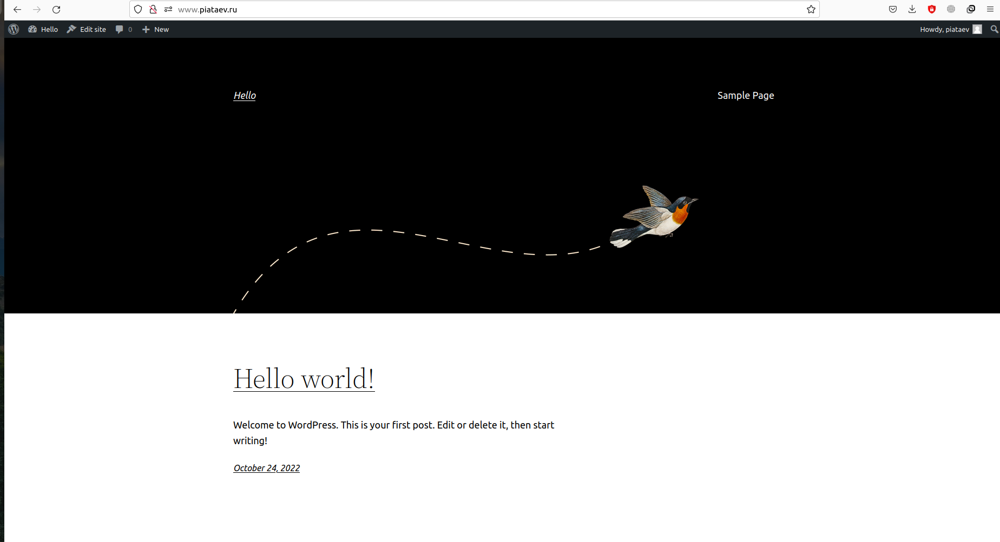
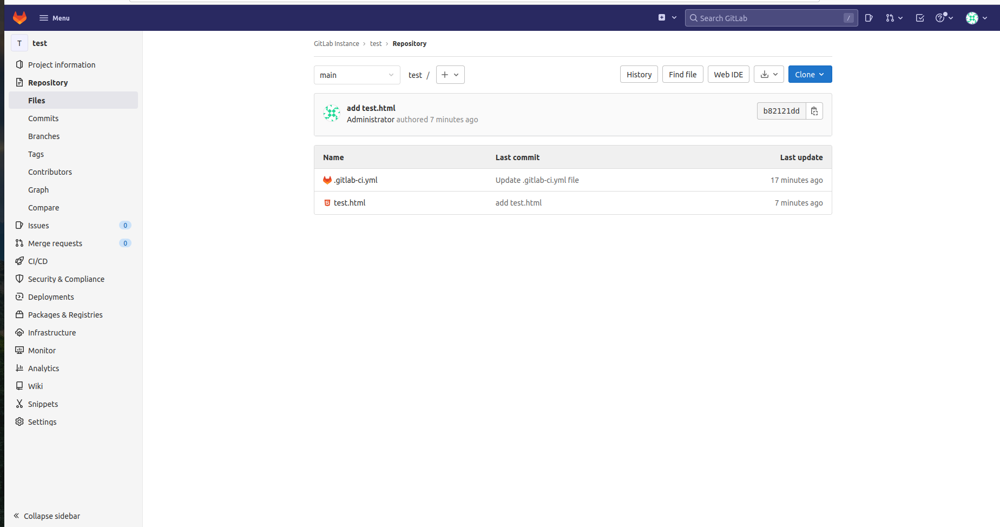

# Дипломный практикум в YandexCloud
  * [Цели:](#цели)
  * [Этапы выполнения:](#этапы-выполнения)
      * [Регистрация доменного имени](#регистрация-доменного-имени)
      * [Создание инфраструктуры](#создание-инфраструктуры)
          * [Установка Nginx и LetsEncrypt](#установка-nginx)
          * [Установка кластера MySQL](#установка-mysql)
          * [Установка WordPress](#установка-wordpress)
          * [Установка Gitlab CE, Gitlab Runner и настройка CI/CD](#установка-gitlab)
          * [Установка Prometheus, Alert Manager, Node Exporter и Grafana](#установка-prometheus)
  * [Что необходимо для сдачи задания?](#что-необходимо-для-сдачи-задания)
  * [Как правильно задавать вопросы дипломному руководителю?](#как-правильно-задавать-вопросы-дипломному-руководителю)

---
## Цели:

1. Зарегистрировать доменное имя (любое на ваш выбор в любой доменной зоне).
2. Подготовить инфраструктуру с помощью Terraform на базе облачного провайдера YandexCloud.
3. Настроить внешний Reverse Proxy на основе Nginx и LetsEncrypt.
4. Настроить кластер MySQL.
5. Установить WordPress.
6. Развернуть Gitlab CE и Gitlab Runner.
7. Настроить CI/CD для автоматического развёртывания приложения.
8. Настроить мониторинг инфраструктуры с помощью стека: Prometheus, Alert Manager и Grafana.

---
## Этапы выполнения:

### Регистрация доменного имени

Зарегистрировано доменное имя "piataev.ru" на регистраторе jino.ru.
Настроено делегирование на сервера яндекса: 
ns1.yandexcloud.net
ns2.yandexcloud.net.


### Создание инфраструктуры

Настроен workspace. Вся работа проводится в пространстве stage.
```
root@vir-PC:~# terraform workspace list
  default
* stage
```
Кодом описано создание сетеи и 7 виртуальных машин. 
Прописаны "A" записи.
Вся инфраструктура поднимается вводом команды 'terraform apply -auto-approve'
Так же терраформ подготавливает файл inventory для последующего использования и передает управление ansible. 

```
null_resource.revers (local-exec): PLAY RECAP *********************************************************************
null_resource.revers (local-exec): app                        : ok=31   changed=26   unreachable=0    failed=0    skipped=0    rescued=0    ignored=0
null_resource.revers (local-exec): db01                       : ok=26   changed=19   unreachable=0    failed=0    skipped=0    rescued=0    ignored=0
null_resource.revers (local-exec): db02                       : ok=26   changed=19   unreachable=0    failed=0    skipped=0    rescued=0    ignored=0
null_resource.revers (local-exec): gitlab                     : ok=14   changed=13   unreachable=0    failed=0    skipped=0    rescued=0    ignored=0
null_resource.revers (local-exec): monitoring                 : ok=53   changed=43   unreachable=0    failed=0    skipped=0    rescued=0    ignored=0
null_resource.revers (local-exec): revers                     : ok=36   changed=27   unreachable=0    failed=0    skipped=0    rescued=0    ignored=0
null_resource.revers (local-exec): runner                     : ok=21   changed=16   unreachable=0    failed=0    skipped=0    rescued=0    ignored=0

null_resource.revers: Creation complete after 24m1s [id=1745757919930548759]

Apply complete! Resources: 20 added, 0 changed, 0 destroyed.

Outputs:

external_ip_address_revers = "51.250.71.118"
internal_ip_address_app = "192.168.101.14"
internal_ip_address_db01 = "192.168.101.12"
internal_ip_address_db02 = "192.168.101.13"
internal_ip_address_gitlab = "192.168.101.15"
internal_ip_address_monitoring = "192.168.101.17"
internal_ip_address_revers = "192.168.101.11"
internal_ip_address_runner = "192.168.101.16"

real    26m32,088s
user    3m11,179s
sys     0m27,417s
```
После ввода команды terraform apply -auto-approve вся инфраструктура, и настройка происходит за 26 минут.

---
### Установка Nginx и LetsEncrypt

Разработана роль для установки Nginx и LetsEncrypt "install-nginx"
Роль устанавливает nginx и робота для автоматической генерации сертификатов.
В процессе выполнения роли робот запрашивает сертификаты для сайтов домена.


___
### Установка кластера MySQL

Разработана роль для установки кластера MySQL.
Роль разворачивает кластер MySQL на двух ВМ db01 и db02, создает пользователей и настраивает репликацию.

```
ubuntu@db01:~$ sudo mysql
mysql> show databases;
+--------------------+
| Database           |
+--------------------+
| information_schema |
| mysql              |
| performance_schema |
| sys                |
| wordpress          |
+--------------------+
5 rows in set (0.00 sec)
```

```
ubuntu@db02:~$ sudo mysql
mysql> SHOW REPLICA STATUS\G;
*************************** 1. row ***************************
             Replica_IO_State: Connecting to source
                  Source_Host: db01
                  Source_User: replication_user
                  Source_Port: 3306
                Connect_Retry: 60
              Source_Log_File: mysql-bin.000002
          Read_Source_Log_Pos: 157
               Relay_Log_File: mysql-relay-bin.000001
                Relay_Log_Pos: 4
        Relay_Source_Log_File: mysql-bin.000002
           Replica_IO_Running: Connecting
          Replica_SQL_Running: Yes
              Replicate_Do_DB: 
          Replicate_Ignore_DB: 
```          

___
### Установка WordPress

Разработана роль для установки WordPress. 
Роль устанавливает WordPress и Apache на ВМ .


---
### Установка Gitlab CE и Gitlab Runner

Разработана роль для установки

Необходимо настроить CI/CD систему для автоматического развертывания приложения при изменении кода.

Настраиваем ci/cd .gitlab-ci.yml file

```
before_script:
  - 'command -v ssh-agent >/dev/null || ( apt-get update -y && apt-get install openssh-client -y )'
  - eval $(ssh-agent -s)
  - echo ${SSH_PRIVATE_KEY}
  - echo $CI_PROJECT_DIR
  - echo "${SSH_PRIVATE_KEY}" | tr -d '\r' | ssh-add
  - mkdir -p ~/.ssh
  - chmod 700 ~/.ssh

stages:         
  - deploy

deploy-job:      
  stage: deploy
  only:
    variables:
      - $CI_COMMIT_TAG =~ /v(\d+\.\d+\.\d+)/

  script:
    - echo "start delivery" 
    - ssh -o StrictHostKeyChecking=no runner@app.piataev.ru sudo chown runner -R /var/www/app.piataev.ru/wordpress/
    - rsync -vz -e "ssh -o StrictHostKeyChecking=no" $CI_PROJECT_DIR/* runner@app.piataev.ru:/var/www/app.piataev.ru/wordpress/
    - echo "remove .git repo from host"
    - ssh -o StrictHostKeyChecking=no runner@app.piataev.ru rm -rf /var/www/app.piataev.ru/wordpress/.git
    - echo "set www-data rigths"
    - ssh -o StrictHostKeyChecking=no runner@app.piataev.ru sudo chown www-data -R /var/www/app.piataev.ru/wordpress/ 
    - echo "Application successfully deployed."
```



После назначения тега v1.0.0 файл test.html доставляется на удаленный сервер. 
_
### Установка Prometheus, Alert Manager, Node Exporter и Grafana

Разработана роль для установки Prometheus, Alert Manager и Grafana. 
Подключен дашборд, отображаются метрики.


---
## Что необходимо для сдачи задания?

1. Репозиторий со всеми Terraform манифестами и готовность продемонстрировать создание всех ресурсов с нуля.
2. Репозиторий со всеми Ansible ролями и готовность продемонстрировать установку всех сервисов с нуля.
3. Скриншоты веб-интерфейсов всех сервисов работающих по HTTPS на вашем доменном имени.
  - `https://www.you.domain` (WordPress)
  - `https://gitlab.you.domain` (Gitlab)
  - `https://grafana.you.domain` (Grafana)
  - `https://prometheus.you.domain` (Prometheus)
  - `https://alertmanager.you.domain` (Alert Manager)
4. Все репозитории рекомендуется хранить на одном из ресурсов ([github.com](https://github.com) или [gitlab.com](https://gitlab.com)).
